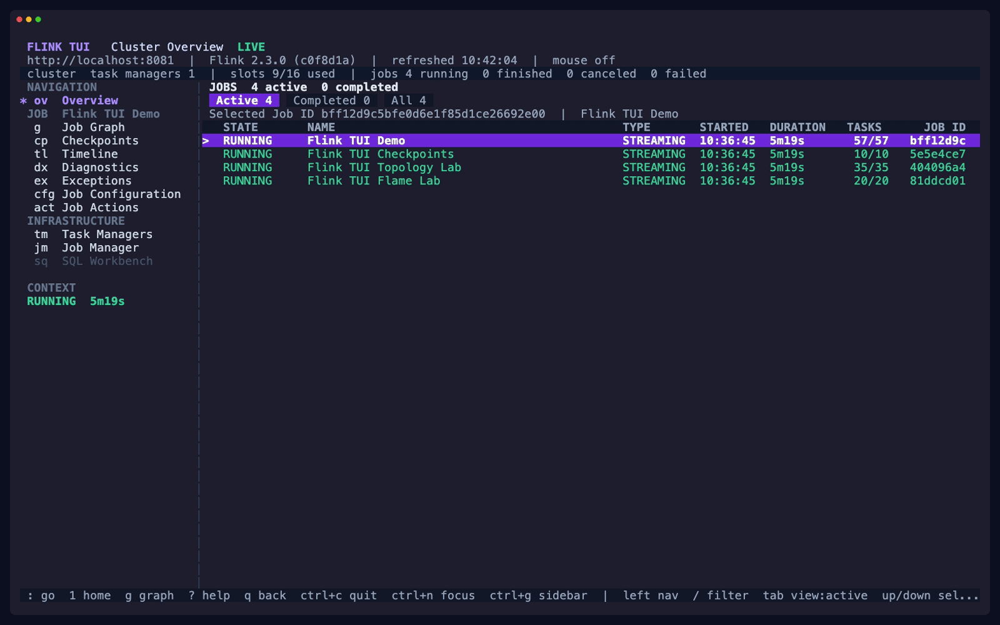

<div align="center">

# Flink TUI

**Alpha software.** Flink TUI is a work in progress. Expect bugs and breaking changes.

**An independent terminal UI for Apache Flink.**

Inspect jobs, find bottlenecks, and follow failures from a graph to a worker thread.

[](go.mod)
[](.github/workflows/e2e.yml)
[](LICENSE)

[Features](#features) · [Get started](#get-started) · [Connection options](#connection-options) · [User guide](docs/guide.md) · [Playground](#try-the-playground) · [Contributing](#contributing)

</div>



<p align="center">
  <em>Live Flink data from the included playground.</em>
</p>

Flink TUI connects to your JobManager REST API and, optionally, a SQL Gateway.
Start with the cluster overview, open a job, and drill into the operators and
processes behind it.

## Features

- **Interactive job graphs.** Throughput, watermarks, busy time, and backpressure
  on a stable graph layout, with zoom, pan, and a minimap for larger pipelines.
- **Connected diagnostics.** Follow an exception to its operator, TaskManager,
  execution thread, or current log. Go back with your previous selection intact.
- **Checkpoint inspection.** Browse history, failure causes, and summary
  statistics; drill into operator and subtask phases to find stragglers.
- **Terminal flame graphs.** Explore live vertex samples and async-profiler
  captures from JobManagers and TaskManagers, including CPU, allocation, and lock
  profiling.
- **Worker and metric explorers.** Inspect memory, slots, logs, stdout, and thread
  dumps. Chart custom metrics and compare user accumulators across subtasks.
- **SQL workbench.** Edit, execute, and cancel statements against a SQL Gateway,
  with streaming results and Flink changelog row types.
- **Job controls.** Trigger checkpoints and savepoints, stop with a savepoint,
  drain, or cancel a job. Each action requires a separate confirmation.

## Get started

Install with **Go 1.25 or newer**:

```sh
go install github.com/nikitasavinov/flink-tui/cmd/flink-tui@latest
flink-tui --endpoint http://localhost:8081 --sql-endpoint ''
```

Or build from a checkout:

```sh
git clone https://github.com/nikitasavinov/flink-tui.git
cd flink-tui
make build
./bin/flink-tui --endpoint http://localhost:8081 --sql-endpoint ''
```

Homebrew installation is coming soon.

Set `--endpoint` to your JobManager REST address. The example disables SQL;
[configure a SQL Gateway](#connection-options) to enable the workbench.
Docker is needed only for the playground and integration tests.

The TUI opens on **Cluster Overview** and refreshes every three seconds.
Use the arrow keys to select a job, `Enter` to open it, and `?` for help on
the current screen.

## Connection options

Flink TUI connects to two different Flink services:

- **JobManager REST API** (default port `8081`): jobs, metrics, checkpoints,
  and process diagnostics. Configure it with `--endpoint`.
- **[SQL Gateway](https://nightlies.apache.org/flink/flink-docs-release-2.3/docs/sql/interfaces/sql-gateway/overview/)**
  (default port `8083`): SQL sessions, statements, and query results. Configure
  it with `--sql-endpoint`; it can have its own host and credentials.

The SQL Gateway is needed only for the SQL workbench. Use `--sql-endpoint ''`
if you only need cluster inspection and job controls.

To enable the workbench, connect to both services:

```sh
flink-tui \
  --endpoint http://localhost:8081 \
  --sql-endpoint http://localhost:8083
```

| Flag | Default | Purpose |
| --- | --- | --- |
| `--endpoint` | `http://localhost:8081` | JobManager REST address |
| `--sql-endpoint` | `http://localhost:8083` | SQL Gateway address; `''` disables SQL |
| `--job` | Cluster Overview | Open a specific job graph by Job ID |
| `--refresh` | `3s` | Periodic refresh interval |

<details>
<summary><strong>Authentication and TLS</strong></summary>

Use basic authentication, a bearer token, a private CA, or mutual TLS as
required by your cluster. For example:

```sh
flink-tui \
  --endpoint https://flink.example.com \
  --bearer-token-file /path/to/token \
  --ca-cert /path/to/ca.pem \
  --sql-endpoint ''
```

| Setting | Flag | Environment variable |
| --- | --- | --- |
| Basic auth username | `--username` | `FLINK_TUI_USERNAME` |
| Basic auth password | `--password-file` | `FLINK_TUI_PASSWORD` |
| Bearer token | `--bearer-token-file` | `FLINK_TUI_BEARER_TOKEN` |
| CA bundle | `--ca-cert` | `FLINK_TUI_CA_CERT` |
| Client certificate | `--client-cert` | `FLINK_TUI_CLIENT_CERT` |
| Client key | `--client-key` | `FLINK_TUI_CLIENT_KEY` |

Password and token environment variables contain the secret itself; their
flags read it from a file. An explicit credential file takes precedence over
its matching environment variable. Basic and bearer authentication are
mutually exclusive; client certificates require both a certificate and key.

SQL Gateway security is configured independently: use the same flags with a
`--sql-` prefix, such as `--sql-bearer-token-file`, and environment variables
beginning with `FLINK_TUI_SQL_`.

TLS certificates are verified by default. `--insecure-skip-verify` and
`--sql-insecure-skip-verify` disable verification for diagnostics.

</details>

Run `flink-tui --help` for all options. The
[user guide](docs/guide.md#command-line-options) includes command examples,
all authentication settings, and the full screen-by-screen reference.

## Try the playground

The playground starts a local Flink cluster, a SQL Gateway, and four demo jobs.
Requires **Docker with Compose** and **Go 1.25+**. From the repository root:

```sh
make up
make build
./bin/flink-tui
```

The Web UI and REST API are at <http://localhost:8081>; the SQL Gateway is at
<http://localhost:8083>. Both ports bind to localhost. The default Flink version
is **2.3.0**, with profiling and vertex flame graphs enabled.

| Job | Explore |
| --- | --- |
| Flink TUI Demo | A 30-vertex pipeline with intentional backpressure |
| Flink TUI Checkpoints | A small stateful job checkpointing every three seconds |
| Flink TUI Topology Lab | A 35-vertex graph with joins, branching, and long edges |
| Flink TUI Flame Lab | Nested CPU, allocation, and lock contention workloads |

For a first investigation:

1. Type `/Flink TUI Demo`, then press `Enter` to open its graph.
2. Select an operator and press `Enter` for its subtasks.
3. Press `d` to open the selected subtask's worker thread dump.
4. Press `q` to retrace your steps, or `Ctrl+P` to jump to another view.

Job submitter containers exit successfully after starting their jobs; the jobs
continue running in Flink. Stop the playground with:

```sh
make down
```

See the [fixture build notes](demo-job/README.md) for demo-job version
compatibility and building the fixtures separately.

## Keyboard basics

See the **[full user guide](docs/guide.md)** for every screen's controls,
[palette commands](docs/guide.md#command-palette-and-sidebar),
[SQL editing](docs/guide.md#sql-workbench), and
[investigation walkthroughs](docs/guide.md#investigation-walkthroughs).

These shortcuts apply while navigating. Press `?` for controls specific to the
current screen; press `Esc` first if you are entering text.

| Key | Action |
| --- | --- |
| Arrow keys | Move the selection |
| `Enter` | Open the selection or drill into details |
| `/` | Filter lists or search logs |
| `Ctrl+P` or `:` | Open the command palette |
| `Ctrl+N` | Switch focus between navigation and content |
| `Ctrl+G` | Show or hide the navigation sidebar |
| `q` | Go back or cancel |
| `1` | Return to Cluster Overview |
| `<` / `>` | Compare the previous or next job, vertex, checkpoint, or process in the same view |
| `r` | Refresh the current view |
| `Space` | Pause or resume periodic refresh |
| `m` | Toggle mouse capture |
| `?` | Show help |
| `Ctrl+C` | Quit |

The command palette finds screens, jobs, vertices, and TaskManagers. It also
accepts names such as `logs`, `profiler`, `savepoint`, and `sql`.
Returning home with `1` parks your investigation; `Ctrl+O` resumes it.

On a **job graph**, use `F` for the vertex flame graph, `v` for custom metrics,
and `u` for accumulators. `+` / `-` changes zoom, `f` fits the graph, and
`z` toggles the minimap.

In **SQL**, press `i` to enter insert mode and `Esc` to return to normal mode.
`F5` or `Ctrl+Enter` executes the statement; `Ctrl+X` cancels it.

Mouse capture starts off so terminal text selection and copying work normally.
Enable it with `m` to click rows, select vertices, and drag the graph or minimap.

## Compatibility and scope

The [integration suite](.github/workflows/e2e.yml) runs against **Flink 1.20.5
and 2.3.0 on Java 17**, covering REST compatibility, SQL, navigation, and live
graph rendering. Other Flink versions are untested.

- Live vertex flame graphs require `rest.flamegraph.enabled: true`; process
  captures require `rest.profiling.enabled: true` on the cluster.
- Job submission and JAR uploads remain in Flink Web UI.
- Logs, stdout, and profiler reports are limited to **16 MiB per download**.
  Larger files produce an error and can be downloaded directly from Flink.
- The SQL workbench retains the latest **500 rows**. Query history, completion,
  and export are outside its current scope. Restart the TUI if the Gateway
  expires its session.

Connection status distinguishes live, stale, disconnected, and partially
available data. If a refresh partly fails, the last known values stay visible
with a degraded status.

## Contributing

Bug reports and focused pull requests are welcome. For bugs, include your
Flink version, terminal, reproduction steps, and any relevant error text
with credentials removed.

```sh
make build
make test-race
make lint
```

The Docker-backed integration suite runs with `make test-e2e`; the
[user guide](docs/guide.md#development-commands) lists every development
command. The [demo recording](scripts/demo.tape) can be reproduced with VHS
against the local playground.

## License

Copyright 2026 Flink TUI contributors.

Licensed under the [Apache License, Version 2.0](LICENSE).

## Affiliation and trademarks

Flink TUI is an independent project. It is not affiliated with, endorsed by,
or sponsored by the Apache Software Foundation or the Apache Flink project.

Apache, [Apache Flink](https://flink.apache.org/), Flink, and the Flink logo
are trademarks of the [Apache Software Foundation](https://www.apache.org/).
This project claims no ownership of those trademarks.
